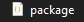
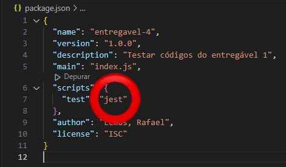
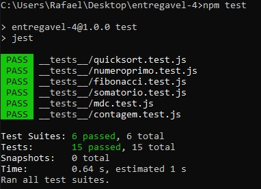

# Guia para Rodar os Testes com Jest

Este guia irá ajudá-lo a configurar e executar os testes usando Jest para um conjunto de códigos do entregável 1 em JavaScript.

## Requisitos

Certifique-se de ter o Node.js instalado no seu sistema. Você pode baixá-lo [aqui](https://nodejs.org/).

## Instalação

1. Clone este repositório para o seu computador:

```bash
git clone https://github.com/rafalemosfrs/entregavel-4.git
```

2. Navegue até o diretório do projeto:

```bash
cd /entregavel-4
```

3. Instale as dependências do projeto:

```bash
npm install

npm install --save-dev jest

npm init
```

4. Verifique se o arquivo **"Package.JSON"** foi criado no seu diretório principal



5. Configure o "scripts" do seu **"Package.JSON"** para "jest"



## Execução dos Testes

1. Após a instalação das dependências, você pode rodar os testes usando o seguinte comando:

```bash
npm test
```

Isso executará todos os testes presentes no diretório **__ tests __** usando o Jest. Os resultados dos testes serão exibidos no terminal.

## Exemplo de Uso

Por exemplo, vamos supor que você queira testar a função calcularMDC:

1. Abra o arquivo __tests__/calcularMDC.test.js.
  
2. Escreva os testes para a função calcularMDC conforme necessário.
   
3. Execute os testes usando npm test.

## Execução com sucesso

1. Caso seus testes rodem sem erros, seu CMD deve aparecer exatamente assim:




